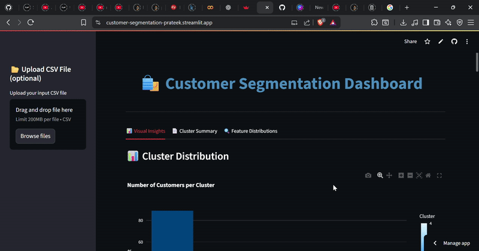

# 🛍️ Customer Segmentation Web App



🔗 Live App Link[[https://customer-segmentation-prateek.streamlit.app/](https://customer-segmentation-prateek.streamlit.app/)]

---

## 📌 Overview

This project is a **Customer Segmentation Dashboard** developed as part of an internship project for **Celebal Technology**. It leverages clustering techniques to categorize mall customers into distinct segments based on their behavior and demographics. The goal is to help businesses make better marketing and product decisions through insightful data-driven visualizations.

---

## 🎯 Objective

To segment customers based on:
- Gender
- Age
- Annual Income
- Spending Score

...and analyze patterns using interactive visual dashboards for better understanding of customer behavior.

---

## 🔍 Features

- 📤 Upload your own dataset (or use the default built-in one)
- 🤖 Clustering using pre-trained KMeans model
- 📊 Interactive visualizations using Plotly and Seaborn
  - Cluster-wise distribution
  - Average income, age, and spending score
  - 3D scatter plot for deeper insights
  - Histograms for feature distributions
- 📈 Cluster summary in tabular format
- 🎯 Visually appealing layout and mobile-friendly UI
- 👤 Personalized footer: **Made by Prateek Agrawal**

---

## 🧠 Why This Was Made

This was created during my internship at **Celebal Technology** to:
- Apply machine learning and data visualization skills in a real-world scenario
- Demonstrate customer segmentation capabilities to non-technical business stakeholders
- Learn deployment workflows using Streamlit Cloud

---

## 🏗️ Tech Stack Used

- **Python**
- **Pandas** – Data handling
- **Scikit-learn** – Clustering with KMeans
- **Matplotlib & Seaborn** – Statistical plots
- **Plotly** – Interactive charts and 3D visualizations
- **Streamlit** – Web application framework
- **Joblib** – Model serialization

---

## 📊 Dataset Features Used

| Feature                | Description                              |
|------------------------|------------------------------------------|
| Gender                 | Male or Female (converted to numeric)    |
| Age                   | Age of the customer                      |
| Annual Income (k$)    | Yearly income in thousand dollars         |
| Spending Score (1–100)| Measure of spending behavior             |

---

## 📈 What We Inferred

- Some clusters have **high spending score and high income**, indicating premium customers
- Other clusters spend less despite high income, possibly **conservative buyers**
- Age also plays a role in **segment behavior**, helping design age-specific campaigns

---

## 🧑‍🎓 What I Learned

- Real-world clustering and its use in marketing strategies
- Using Streamlit for deploying interactive ML dashboards
- Handling dynamic datasets with file upload options
- Building appealing and meaningful visualizations
- Project structuring and user-friendly design for analytics apps

---

## 📁 Folder Structure

```
customer_segmentation_app/
├── app.py
├── kmeans_model.pkl
├── Mall_Customers.csv
├── project_vid.gif
└── README.md
```


---

## ✍️ Made by

**Prateek Agrawal**  
Intern at **Celebal Technology**  
[https://customer-segmentation-prateek.streamlit.app/](https://customer-segmentation-prateek.streamlit.app/)

---
